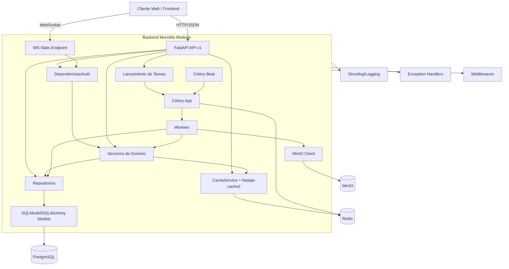

# Análisis exhaustivo de la arquitectura backend implementada

## Resumen ejecutivo

La arquitectura backend implementada corresponde a un **monolito modular en capas**, con una aproximación **DDD pragmática**, y con **procesamiento asíncrono** desacoplado mediante Celery.

Esto se observa en la separación explícita entre:

- Capa de entrada (API REST/WebSocket)
- Capa de aplicación/dominio (servicios)
- Capa de acceso a datos (repositorios)
- Infraestructura transversal (DB, Redis, MinIO, logging, middlewares, excepciones)
- Capa de ejecución asíncrona (workers y tareas periódicas)

---

## 1) Arquitectura de software backend implementada

La arquitectura es una combinación de:

1. **Arquitectura en capas** (presentation, application/domain, persistence, infra)
2. **Monolito modular** (una sola aplicación desplegable con módulos cohesivos)
3. **Repository Pattern** para persistencia
4. **Servicios de dominio/aplicación** para la lógica de negocio no trivial
5. **Procesamiento asíncrono orientado a tareas** con Celery + Redis

---

## 2) ¿Por qué es esta arquitectura?

Porque el código evidencia patrones consistentes:

- **Composición por capas** mediante dependencias e inyección en `app.api.deps`
- **Ruteo centralizado y modular** por subdominios en `app/api/v1/routes`
- **Repositorios por agregado de dominio** en `app/repositories`
- **Servicios especializados** para análisis, validación, versionado, exportación en `app/services/feature_model`
- **Infraestructura desacoplada en `app/core`** (config, db, redis, cache, celery, s3, logging)
- **Cross-cutting concerns** gestionados por middlewares y handlers globales de excepciones
- **Operaciones de alto costo en background** con tareas Celery y programación periódica (Beat)

---

## 3) Componentes o elementos esenciales

### Núcleo de aplicación

- **Entrypoint y ciclo de vida**: `backend/app/main.py`
- **API v1 (REST)**: `backend/app/api/v1/router.py` + `backend/app/api/v1/routes/*`
- **WebSocket de estadísticas**: `backend/app/api/v1/routes/feature_model_statistics_ws.py`
- **Dependencias y autenticación/autorización**: `backend/app/api/deps.py`, `backend/app/core/security.py`

### Dominio y lógica de negocio

- **Servicios de Feature Model**: `backend/app/services/feature_model/*`
  - `fm_logical_validator.py`
  - `fm_structural_analyzer.py`
  - `fm_configuration_generator.py`
  - `fm_version_manager.py`
  - `fm_export.py`
  - `fm_analysis_facade.py`

### Persistencia

- **Modelos SQLModel/Pydantic**: `backend/app/models/*`
- **Repositorios asíncronos**: `backend/app/repositories/*`
- **Motor/sesiones DB**: `backend/app/core/db.py`

### Infraestructura

- **Configuración central**: `backend/app/core/config.py`
- **Redis y caché**: `backend/app/core/redis.py`, `backend/app/core/cache.py`
- **Object storage MinIO**: `backend/app/core/s3.py`
- **Logging estructurado**: `backend/app/core/logging.py`
- **Middlewares**: `backend/app/middlewares.py`
- **Manejo global de excepciones**: `backend/app/exceptions/*`
- **Panel administrativo**: `backend/app/admin.py`

### Asincronía y operación

- **Celery app y routing de colas**: `backend/app/core/celery.py`
- **Tareas asíncronas**: `backend/app/tasks/*`
- **Programación periódica**: `backend/app/core/beat_schedule.py`

---

## 4) Diagrama de componentes y relaciones

---

## 5) Función de cada componente

- **FastAPI API**: expone endpoints de negocio, validación, análisis, exportación, administración y seguridad.
- **WebSocket**: entrega datos en tiempo real para dashboards/edición colaborativa.
- **Dependencias/Auth**: resuelve sesión de DB por request, repositorios y usuario autenticado vía JWT.
- **Servicios de dominio**: concentra reglas complejas y orquestación de casos de uso.
- **Repositorios**: encapsulan consultas y persistencia, separando dominio de infraestructura SQL.
- **Modelos**: definen contratos de persistencia y de intercambio API.
- **Cache (Redis)**: mejora latencia y coordina locks/estado de tareas.
- **Celery + workers**: ejecutan procesos pesados fuera del ciclo request-response.
- **Celery Beat**: agenda mantenimientos periódicos (integridad, métricas, limpieza).
- **PostgreSQL**: fuente de verdad transaccional del dominio.
- **MinIO**: almacena artefactos/exportaciones y recursos binarios.
- **Middlewares**: implementan políticas transversales (seguridad docs internas, invalidación de cache).
- **Exception handlers**: estandarizan respuesta de errores de dominio y técnicos.
- **Logging**: trazabilidad operacional estructurada para observabilidad.

---

## Conclusión

El backend actual está bien encaminado hacia una arquitectura empresarial: modular, explícita, con infraestructura separada y capacidades de escalado asíncrono. La principal evolución pendiente para llegar a Clean/Hexagonal completa es **invertir dependencias** mediante puertos/adaptadores y reforzar límites de contexto entre dominio y framework.
