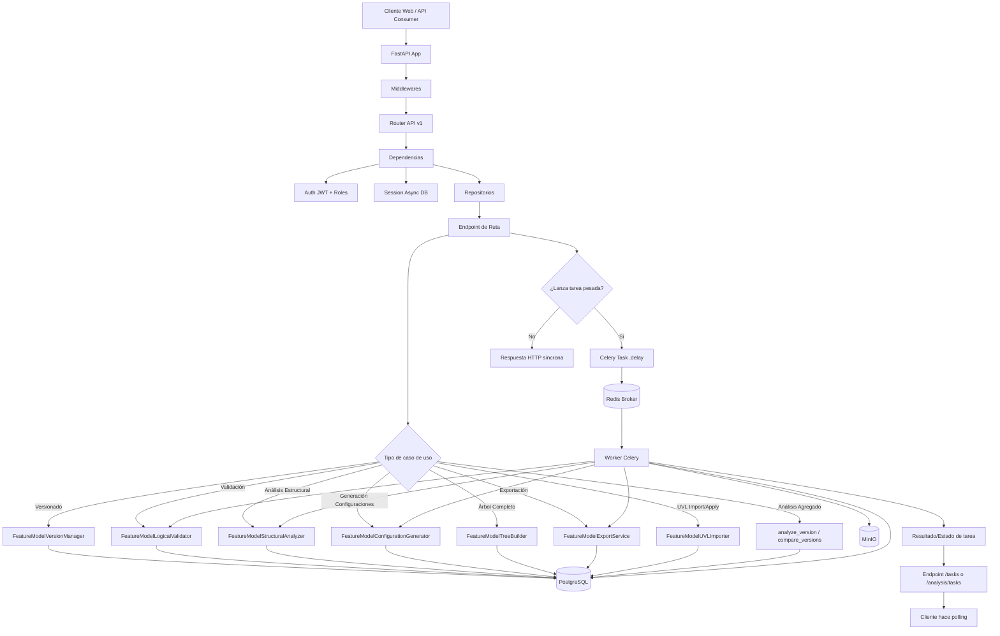
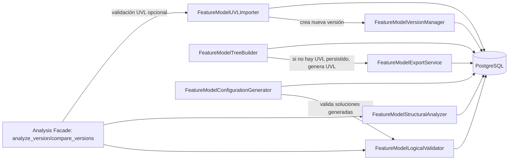
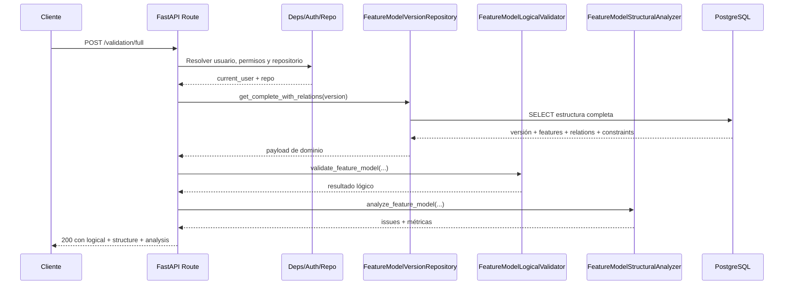
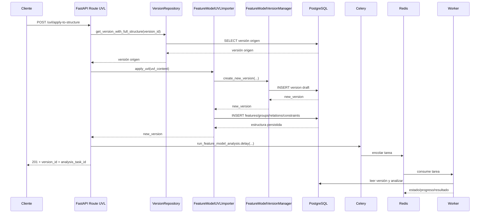
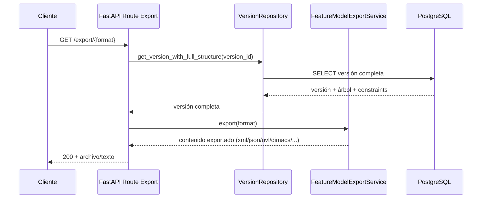

# Diagrama de interacción entre servicios de dominio y ciclo de vida HTTP

Fecha: 2026-04-12

## Objetivo

Mostrar cómo una petición del cliente atraviesa la plataforma (FastAPI) hasta llegar a los servicios de dominio de Feature Model, y cómo se relacionan esos servicios entre sí.

---

## 1) Ciclo de vida HTTP (alto nivel)

---

## 2) Relación interna entre servicios de dominio

### Lectura del diagrama

- `FeatureModelUVLImporter` depende de `FeatureModelVersionManager` para materializar una nueva versión al aplicar UVL.
- `FeatureModelTreeBuilder` usa `FeatureModelExportService` como fallback para UVL efectivo.
- `FeatureModelConfigurationGenerator` usa `FeatureModelLogicalValidator` para asegurar validez.
- `fm_analysis_facade` orquesta validación lógica + análisis estructural + validación UVL.

---

## 3) Secuencia típica A: validación síncrona de modelo

Endpoint representativo: `POST /feature-models/{model_id}/versions/{version_id}/validation/full`

---

## 4) Secuencia típica B: UVL aplicado a estructura + análisis asíncrono

Endpoint representativo: `POST /feature-models/{model_id}/versions/{version_id}/uvl/apply-to-structure`

---

## 5) Secuencia típica C: exportación de versión

Endpoint representativo: `GET /feature-models/{model_id}/versions/{version_id}/export/{format}`

---

## 6) Mapeo rápido endpoint → servicio principal

| Tipo de operación                  | Endpoint(s) ejemplo                                                                | Servicio principal                                                      |
| ---------------------------------- | ---------------------------------------------------------------------------------- | ----------------------------------------------------------------------- |
| Versionado                         | `/feature-models/{id}/versions`, `/publish`, `/archive`, `/restore`                | `FeatureModelVersionManager`                                            |
| Validación lógica/estructural/full | `/feature-models/{id}/versions/{vid}/validation/*`                                 | `FeatureModelLogicalValidator`, `FeatureModelStructuralAnalyzer`        |
| Análisis agregado/comparación      | `/feature-models/{id}/versions/{vid}/analysis/summary`, `/analysis/compare`        | `analyze_version`, `compare_versions` (facade)                          |
| Configuraciones                    | `/configurations/generate`, `/configurations/optimize`, `/configurations/validate` | `FeatureModelConfigurationGenerator` (+ `FeatureModelLogicalValidator`) |
| Árbol completo                     | `/feature-models/{id}/versions/{vid}/complete`                                     | `FeatureModelTreeBuilder`                                               |
| Exportación                        | `/feature-models/{id}/versions/{vid}/export/{format}`                              | `FeatureModelExportService`                                             |
| UVL textual                        | `/feature-models/{id}/versions/{vid}/uvl*`                                         | `FeatureModelUVLImporter` + `FeatureModelExportService`                 |
| Tareas en background               | `/analysis/batch*`, `/tasks/{task_id}`                                             | Celery tasks (usan servicios de dominio)                                |

---

## 7) Referencias técnicas

- Entrada y ciclo de vida app: [backend/app/main.py](backend/app/main.py)
- Registro de rutas API v1: [backend/app/api/v1/router.py](backend/app/api/v1/router.py)
- Dependencias HTTP (auth, sesión, repos): [backend/app/api/deps.py](backend/app/api/deps.py)
- Módulo de servicios de dominio FM: [backend/app/services/feature_model/**init**.py](backend/app/services/feature_model/__init__.py)
- Rutas clave:
  - [backend/app/api/v1/routes/feature_model_validation.py](backend/app/api/v1/routes/feature_model_validation.py)
  - [backend/app/api/v1/routes/feature_model_analysis.py](backend/app/api/v1/routes/feature_model_analysis.py)
  - [backend/app/api/v1/routes/feature_model_complete.py](backend/app/api/v1/routes/feature_model_complete.py)
  - [backend/app/api/v1/routes/feature_model_export.py](backend/app/api/v1/routes/feature_model_export.py)
  - [backend/app/api/v1/routes/feature_model_uvl.py](backend/app/api/v1/routes/feature_model_uvl.py)
  - [backend/app/api/v1/routes/configuration.py](backend/app/api/v1/routes/configuration.py)
  - [backend/app/api/v1/routes/feature_model_version.py](backend/app/api/v1/routes/feature_model_version.py)

---

## 8) Validación del diagrama contra implementación real (resultado)

### Veredicto general

El diagrama está **bien construido y es mayormente consistente** con la implementación actual del backend para Feature Models.

### Aciertos confirmados

1. **Flujo HTTP principal correcto**: cliente → FastAPI → dependencias → repositorios/servicios.
2. **Orquestación de servicios de dominio correcta**:
   - `FeatureModelUVLImporter` usa `FeatureModelVersionManager`.
   - `FeatureModelTreeBuilder` usa `FeatureModelExportService` para UVL efectivo.
   - `FeatureModelConfigurationGenerator` delega validación en `FeatureModelLogicalValidator`.
   - `analyze_version/compare_versions` (facade) combinan validación lógica + análisis estructural.
3. **Asincronía con Celery/Redis** correctamente reflejada para análisis y tareas pesadas.

### Ajustes recomendados (precisión)

1. En el flujo de polling de tareas, usa explícitamente:
   - `GET /feature-models/analysis/tasks/{task_id}`
     en lugar de solo `/tasks/{task_id}`.

2. En el mapeo de endpoints, para validación síncrona, el endpoint representativo `validation/full` está correcto; conviene además mencionar que existen endpoints específicos:
   - `/validation/model`, `/validation/structure`, `/validation/configuration`, `/validation/analysis`.

### Conclusión

El documento es **válido para arquitectura y comunicación técnica**. Solo requiere un ajuste menor de nomenclatura en el polling para quedar totalmente alineado al código.

---

## 9) Servicios de Feature Model: características, objetivos y funcionalidad

### 9.1 `FeatureModelVersionManager`

- **Objetivo**: gobernar el ciclo de vida de versiones de un FM.
- **Características**:
  - versionado incremental;
  - control de estados (`DRAFT`, `PUBLISHED`, `ARCHIVED`);
  - construcción de snapshots reproducibles.
- **Funcionalidad principal**:
  - crear nueva versión (vacía o desde origen);
  - publicar/archivar/restaurar;
  - validar transición de estado y consistencia mínima.

### 9.2 `FeatureModelLogicalValidator`

- **Objetivo**: validar consistencia lógica/satisfacibilidad del modelo y de configuraciones.
- **Características**:
  - validación multinivel (`sympy`, `pysat`, `z3`);
  - detección de contradicciones;
  - soporte de enumeración/validación de configuraciones.
- **Funcionalidad principal**:
  - `validate_feature_model(...)`;
  - `validate_configuration(...)`;
  - utilidades de análisis lógico sobre constraints/relaciones.

### 9.3 `FeatureModelStructuralAnalyzer`

- **Objetivo**: inspeccionar propiedades estructurales del modelo (grafo/árbol).
- **Características**:
  - detección de dead features y redundancias;
  - SCC, dependencias transitivas y métricas de complejidad;
  - análisis con NetworkX cuando está disponible.
- **Funcionalidad principal**:
  - `analyze_feature_model(...)`;
  - validaciones estructurales y métricas derivadas.

### 9.4 `FeatureModelConfigurationGenerator`

- **Objetivo**: generar configuraciones válidas/óptimas para una versión.
- **Características**:
  - estrategias múltiples (`GREEDY`, `RANDOM`, `BEAM`, `GENETIC`, `SAT_ENUM`, `NSGA2`, etc.);
  - soporte de selección parcial;
  - validación integrada con el validador lógico.
- **Funcionalidad principal**:
  - generar una/múltiples configuraciones;
  - completar configuraciones parciales;
  - optimización y diversidad de soluciones.

### 9.5 `FeatureModelTreeBuilder`

- **Objetivo**: construir una respuesta completa y renderizable del FM.
- **Características**:
  - armado de árbol jerárquico de features;
  - inclusión opcional de recursos/estadísticas;
  - cálculo de UVL efectivo (persistido o generado).
- **Funcionalidad principal**:
  - `build_complete_response(...)`;
  - composición de `tree`, `relations`, `constraints`, `statistics` y metadata.

### 9.6 `FeatureModelExportService`

- **Objetivo**: exportar el modelo a formatos interoperables.
- **Características**:
  - mapeo UUID↔int para SAT/export;
  - soporte de múltiples formatos (`XML`, `TVL`, `DIMACS`, `JSON`, `UVL`, `DOT`, `Mermaid`);
  - fallback para representación textual/visual.
- **Funcionalidad principal**:
  - `export(...)`;
  - transformaciones específicas por formato.

### 9.7 `FeatureModelUVLImporter`

- **Objetivo**: convertir definición UVL en estructura persistida del modelo.
- **Características**:
  - parseo + validación de UVL;
  - creación de nueva versión al aplicar;
  - diff UVL vs estructura actual.
- **Funcionalidad principal**:
  - `validate_uvl_only(...)`;
  - `apply_uvl(...)`;
  - `diff_uvl(...)`.

### 9.8 `Analysis Facade` (`analyze_version`, `compare_versions`)

- **Objetivo**: ofrecer análisis agregado de alto nivel.
- **Características**:
  - orquesta validación lógica + análisis estructural;
  - calcula commonality/core/atomic sets;
  - integración opcional con validación UVL/Flamapy.
- **Funcionalidad principal**:
  - resumen de análisis de una versión;
  - comparación entre dos versiones con delta.
