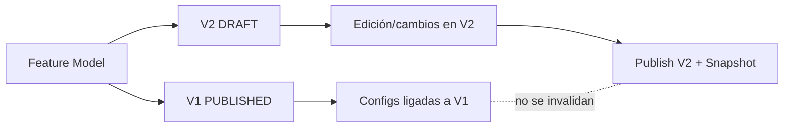

# Presentación de Tesis — Respuesta en 2 diapositivas

## Diapositiva 1 — Criterio arquitectónico que habilita evolución sin romper configuraciones

### Pregunta de tesis

**¿Qué criterio arquitectónico permitió conservar trazabilidad de versiones y evitar invalidar configuraciones aceptadas cuando el FM crece o cambia?**

### Respuesta corta

El criterio central es un **versionado inmutable por snapshots con copy-on-write**, complementado por **aislamiento por versión**.

### Guía de conceptos (núcleo)

| Concepto                                              | Función en el sistema                                  | Efecto arquitectónico                 |
| ----------------------------------------------------- | ------------------------------------------------------ | ------------------------------------- |
| Snapshot inmutable                                    | Congelar el estado completo de una versión publicada   | Reproducibilidad y auditoría          |
| Copy-on-write                                         | Crear nueva versión como copia editable de la anterior | Evolución sin mutar versiones previas |
| Configuración ligada a `feature_model_version_id`     | Asociar cada configuración a una versión específica    | No se rompe compatibilidad histórica  |
| Estados de ciclo de vida (`DRAFT→PUBLISHED→ARCHIVED`) | Controlar cuándo una versión puede cambiar             | Gobernanza y seguridad de cambio      |

---

## Diapositiva 2 — Beneficios, principios de literatura y mensaje de defensa

### Beneficios demostrables

| Beneficio                  | Qué lo habilita                                       | Impacto en tesis                         |
| -------------------------- | ----------------------------------------------------- | ---------------------------------------- |
| Trazabilidad completa      | `version_number` + snapshot + `created_at/created_by` | Evidencia histórica de evolución         |
| Compatibilidad hacia atrás | Aislamiento por versión                               | Configuraciones aceptadas siguen válidas |
| Reproducibilidad técnica   | Mapeo estable UUID↔Integer en snapshot                | Resultados repetibles en export/import   |
| Escalabilidad operativa    | Invalidación de caché granular por versión            | Menor costo de recomputación             |

### Principios arquitectónicos reconocidos en la literatura

- **Inmutabilidad**: el estado publicado no se modifica, se crea uno nuevo.
- **Event Sourcing (parcial por snapshots)**: cada publicación registra un estado histórico consultable.
- **Aggregate Root (DDD)**: `FeatureModelVersion` como frontera consistente del cambio.
- **Separation of Concerns**: edición en `DRAFT`, consumo estable en `PUBLISHED`.
- **Compatibilidad hacia atrás (Backward Compatibility)**: nuevas versiones no invalidan artefactos aceptados.

### Mensaje final para decir en la defensa

**“Diseñamos la evolución del FM con snapshots inmutables y copy-on-write por versión; así, cada cambio vive en una nueva versión aislada, preservando trazabilidad completa y garantizando que las configuraciones previamente aceptadas nunca se invaliden.”**
