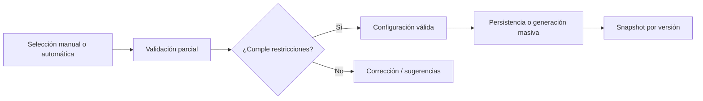

# Resumen para defensa de tesis — 2 diapositivas

## Diapositiva 1 — Fundamentos técnicos del enfoque

### Pregunta

**¿Qué fundamentos técnicos respaldan la viabilidad del enfoque elegido para validar y generar configuraciones en escenarios de alta complejidad combinatoria?**

### Respuesta corta

La viabilidad se sostiene en una **arquitectura por capas** que combina:

- **Validación lógica exacta** con SAT/SMT y simplificación proposicional.
- **Generación flexible** con estrategias GREEDY, RANDOM, BEAM_SEARCH, GENETIC, CP-SAT y BDD.
- **Validación incremental** de configuraciones parciales, incluyendo selección manual de características.
- **Análisis estructural** para detectar dead features, redundancias, ciclos e inconsistencias.
- **Versionado inmutable** para preservar trazabilidad y reproducibilidad.

### Diagrama conceptual

### Guía de conceptos

| Concepto                      | Función                         | Beneficio                       |
| ----------------------------- | ------------------------------- | ------------------------------- |
| SAT/SMT                       | Verifica restricciones formales | Corrección lógica fuerte        |
| Heurísticas y metaheurísticas | Exploran grandes espacios       | Escalabilidad práctica          |
| Validación parcial            | Evalúa decisiones intermedias   | Soporta configuración manual    |
| Snapshot inmutable            | Congela cada versión            | Trazabilidad y reproducibilidad |
| Caché granular                | Reduce recomputación            | Mejor rendimiento               |

---

## Diapositiva 2 — Límites asumidos para escalar

### Pregunta

**¿Qué límites asumió la solución para seguir siendo escalable?**

### Respuesta corta

La solución asume que, en modelos grandes, **no siempre conviene buscar exhaustividad total**; por eso prioriza:

- **Exactitud donde importa**: la validación final sigue siendo obligatoria.
- **Aproximación controlada**: en generación masiva se usan heurísticas y poda.
- **Ejecución asíncrona**: tareas pesadas se llevan a background.
- **Separación por versión**: cada versión se procesa de forma aislada.
- **Métricas y umbrales**: el sistema cambia de estrategia según el tamaño/complejidad del modelo.

### Principios arquitectónicos reconocidos en la literatura

- **Inmutabilidad**: una versión publicada no se modifica.
- **Event sourcing parcial / snapshots**: cada estado relevante queda registrado.
- **Aggregate Root (DDD)**: `FeatureModelVersion` actúa como frontera del cambio.
- **Separation of Concerns**: validar, generar y analizar son responsabilidades distintas.
- **Backward compatibility**: nuevas versiones no invalidan configuraciones aceptadas.

### Cierre oral

**“En síntesis, el sistema es viable porque combina validación exacta con generación heurística y control por versión. Así, puede manejar alta complejidad combinatoria sin perder consistencia, trazabilidad ni escalabilidad.”**
