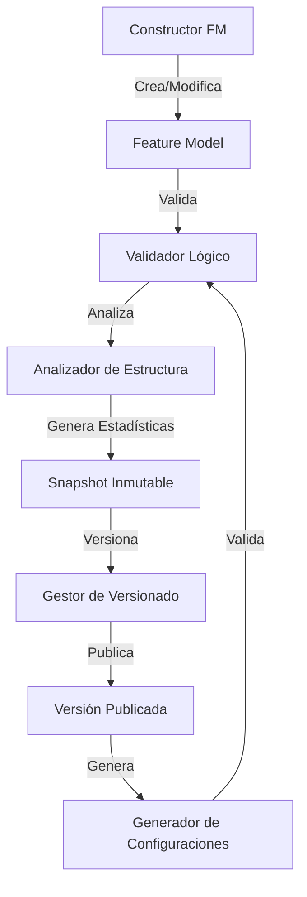

# Arquitectura del Sistema de Feature Models

Este documento describe la arquitectura general del sistema de gestión de Feature Models (Modelos de Características) para la configuración curricular.

## 📚 Documentación Relacionada

- [**Representaciones de Arquitectura**](./architectura_representations.md) - Diagramas y vistas arquitectónicas del sistema
- [**Componentes del Motor de Validación**](./VALIDATION_ENGINE_COMPONENTS.md) - Detalles técnicos del motor de validación
- [**Componentes Principales del Sistema**](./main_components_of_the_system.md) - Implementación detallada de cada componente

---

## 🏗️ Componentes Esenciales del Sistema

El sistema está compuesto por cinco componentes principales que trabajan en conjunto para garantizar la consistencia, validez y trazabilidad de los modelos de características:

### 1. 🔍 Validador Lógico

**Responsabilidad:** Procesamiento de restricciones formales y garantía de consistencia lógica.

**Funciones principales:**

- Procesamiento de restricciones formales y expresiones proposicionales
- Validación de dependencias cross-tree (relaciones `requires` y `excludes`)
- Verificación de cardinalidades en grupos OR/XOR/ALTERNATIVE
- Integración con SAT/SMT solvers para análisis de satisfacibilidad
- Utilización de SymPy para simplificación de expresiones lógicas
- Detección de contradicciones y tautologías en constraints

**Tecnologías:** SAT solvers, SMT solvers, SymPy, análisis proposicional

📖 Ver más: [Componentes del Motor de Validación](./VALIDATION_ENGINE_COMPONENTS.md)

---

### 2. ⚙️ Generador de Configuraciones

**Responsabilidad:** Construcción de configuraciones curriculares válidas y completas.

**Funciones principales:**

- Construcción de configuraciones curriculares válidas
- Completado automático de decisiones basado en restricciones
- Aplicación de inferencias lógicas (propagación de features mandatory)
- Garantía de consistencia en cada selección de features
- Generación de itinerarios curriculares sin conflictos
- Validación de configuraciones antes de persistencia

**Salida:** Configuraciones completas y válidas listas para uso académico

📖 Ver más: [Componentes Principales](./main_components_of_the_system.md#generador-de-configuraciones)

---

### 3. 📊 Analizador de Estructura

**Responsabilidad:** Inspección y análisis de propiedades estructurales del Feature Model.

**Funciones principales:**

- Detección de **dead features** (features nunca seleccionables)
- Identificación de **false optional features** (aparentemente opcionales pero siempre seleccionadas)
- Detección de **redundancias** en constraints
- Identificación de **ciclos** en dependencias
- Detección de **inconsistencias estructurales**
- Cálculo de **métricas topológicas** (profundidad, amplitud, complejidad)
- Análisis mediante teoría de grafos y recorridos DFS/BFS

**Métricas calculadas:**

- Profundidad del árbol (`max_depth`)
- Número total de features (`total_features`)
- Ratio de features opcionales vs mandatory
- Complejidad ciclomática del modelo

📖 Ver más: [Statistics API](./STATISTICS_API.md) | [Componentes del Sistema](./main_components_of_the_system.md#analizador-de-estructura)

---

### 4. 🏗️ Constructor de Modelos de Características

**Responsabilidad:** Creación, modificación y estructuración de Feature Models.

**Funciones principales:**

- Creación y modificación de árboles de características
- Gestión de grupos OR/XOR/ALTERNATIVE
- Configuración de cardinalidades (min/max)
- Establecimiento de relaciones parent-child
- Definición de relaciones cross-tree (requires/excludes)
- Validación estructural durante la construcción
- Soporte para propiedades personalizadas (attributes)

**Patrones implementados:**

- Builder Pattern para construcción incremental
- Composite Pattern para estructura arbórea
- Repository Pattern para persistencia

📖 Ver más: [Implementación del Constructor](./main_components_IMPLEMENTATION_SUMMARY.md)

---

### 5. 📦 Gestor de Versionado de Modelos de Características

**Responsabilidad:** Control de versiones inmutables y trazabilidad histórica.

**Funciones principales:**

- Captura de **snapshots inmutables** del modelo completo
- Control de versiones con numeración secuencial
- Registro de evolución histórica del modelo
- Garantía de **reproducibilidad** de configuraciones pasadas
- Trazabilidad completa de cambios
- Gestión de estados (DRAFT, PUBLISHED, ARCHIVED)
- Preservación de relaciones UUID↔Integer para exportación

**Características clave:**

- Inmutabilidad: Las versiones publicadas nunca cambian
- Snapshot completo: Incluye features, relaciones, constraints y estadísticas
- Mapeo UUID↔Integer para compatibilidad con herramientas externas
- Metadatos de caché para optimización de consultas

📖 Ver más: [Feature Model Versions Info](./FEATURE_MODEL_VERSIONS_INFO.md) | [Complete Structure API](./COMPLETE_STRUCTURE_API.md)

---

## 🔄 Flujo de Trabajo del Sistema

## 🎯 Principios Arquitectónicos

1. **Inmutabilidad de Versiones:** Las versiones publicadas son inmutables y reproducibles
2. **Separación de Responsabilidades:** Cada componente tiene una función claramente definida
3. **Validación en Múltiples Capas:** Validación estructural, lógica y de consistencia
4. **Trazabilidad Completa:** Todo cambio queda registrado con metadatos
5. **Optimización Mediante Caché:** Las estadísticas se precalculan y almacenan
6. **Interoperabilidad:** Soporte para múltiples formatos de exportación (XML, UVL, DIMACS, etc.)

---

## 📖 Documentación Adicional

- [Estructura Completa de la API](./COMPLETE_STRUCTURE_API.md)
- [Árbol de Features](./tree.md)
- [API de Estadísticas](./STATISTICS_API.md)
- [Sumario de Implementación](./IMPLEMENTATION_SUMMARY.md)
- [Cambios Educativos](./CAMBIOS_EDUCATIVOS.md)
- [Maestría en Ciencia de Datos](./MAESTRIA_CIENCIA_DATOS.md)

---

## 🚀 Próximos Pasos

Para entender cómo implementar o extender el sistema, consulta:

1. [Sumario de Implementación de Componentes](./main_components_IMPLEMENTATION_SUMMARY.md)
2. [Componentes del Motor de Validación](./VALIDATION_ENGINE_COMPONENTS.md)
3. [Representaciones Arquitectónicas](./architectura_representations.md)
