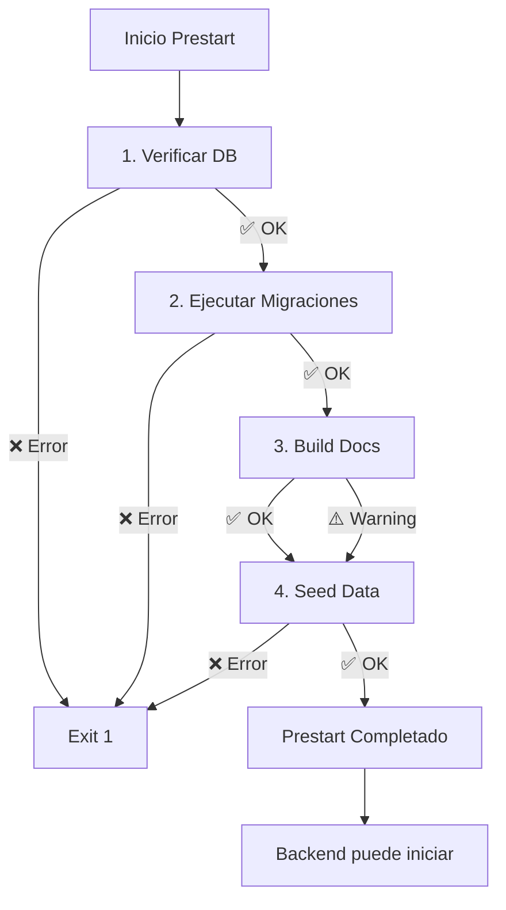

# 📋 Documentación del Servicio Prestart

## Descripción

El servicio `prestart` es un contenedor de inicialización que se ejecuta **antes** de que el backend se inicie. Su propósito es garantizar que todas las dependencias y configuraciones estén listas.

---

## 🎯 Tareas que Ejecuta

El script `backend/scripts/prestart.sh` realiza **4 tareas críticas** en orden:

### 1️⃣ Verificar Conexión a Base de Datos

```bash
python app/backend_pre_start.py
```

- **Propósito**: Esperar a que PostgreSQL esté listo
- **Archivo necesario**: `backend/app/backend_pre_start.py`
- **Falla si**: La base de datos no responde después de varios reintentos

### 2️⃣ Ejecutar Migraciones de Base de Datos

```bash
alembic upgrade head
```

- **Propósito**: Aplicar cambios al esquema de la base de datos
- **Archivos necesarios**:
  - `backend/alembic.ini`
  - `backend/app/alembic/` (carpeta con migraciones)
  - `backend/app/alembic/versions/*.py` (archivos de migración)
- **Falla si**: Alguna migración tiene errores

### 3️⃣ Construir Documentación (Opcional)

```bash
bash root_scripts/build_docs.sh
```

- **Propósito**: Generar documentación interna con MkDocs
- **Archivos necesarios**:
  - `scripts/build_docs.sh`
  - `backend/app/sync_docs.py`
  - `internal_docs/mkdocs.yml`
  - `internal_docs/docs/` (archivos markdown)
  - `backend/docs/` (documentación del backend)
  - `frontend/docs/` (documentación del frontend)
  - `docs/` (documentación raíz)
- **Comportamiento**: Si falla, continúa (no es crítico)

### 4️⃣ Poblar Datos Iniciales (Seeding)

```bash
python -m app.seed.main
```

- **Propósito**: Crear datos iniciales en la base de datos
- **Archivos necesarios**:
  - `backend/app/seed/main.py`
  - `backend/app/seed/seeders.py`
  - `backend/app/seed/data_*.py` (archivos de datos)
- **Comportamiento**:
  - En **desarrollo**: Crea datos de prueba completos
  - En **producción**: Solo datos esenciales (superusuario, settings)
- **Falla si**: Hay errores en los datos de semilla

---

## 📦 Volúmenes Montados en Docker Compose

El servicio `prestart` necesita acceso a múltiples carpetas:

```yaml
volumes:
  # Backend app files
  - ./backend/app:/app/app

  # Backend scripts (contains prestart.sh)
  - ./backend/scripts:/app/scripts

  # Root scripts (contains build_docs.sh)
  - ./scripts:/app/root_scripts

  # Backend docs (for sync_docs.py)
  - ./backend/docs:/app/backend_docs

  # Internal docs (for mkdocs build)
  - ./internal_docs:/app/internal_docs

  # Frontend docs (if needed by sync_docs.py)
  - ./frontend/docs:/app/frontend_docs

  # Root docs (if needed by sync_docs.py)
  - ./docs:/app/root_docs
```

---

## 🔧 Dependencias del Contenedor

### Dependencias de Servicios

```yaml
depends_on:
  db:
    condition: service_healthy
```

El servicio espera a que PostgreSQL esté completamente iniciado antes de ejecutarse.

### Variables de Entorno Requeridas

**Variables críticas** (el servicio falla si no están definidas):

- `POSTGRES_SERVER` → Servidor de base de datos
- `POSTGRES_USER` → Usuario de PostgreSQL
- `POSTGRES_PASSWORD` → Contraseña de PostgreSQL
- `POSTGRES_DB` → Nombre de la base de datos
- `SECRET_KEY` → Clave secreta de la aplicación
- `FIRST_SUPERUSER` → Email del primer superusuario
- `FIRST_SUPERUSER_PASSWORD` → Contraseña del superusuario
- `FRONTEND_HOST` → URL del frontend

**Variables opcionales**:

- `ENVIRONMENT` → Entorno (local/production) - default: local
- `DOMAIN` → Dominio de la aplicación
- `SMTP_HOST`, `SMTP_USER`, `SMTP_PASSWORD` → Configuración de email
- `SENTRY_DSN` → Para monitoreo de errores

---

## 🐛 Troubleshooting

### Problema: "Database connection failed"

**Causa**: PostgreSQL no está listo o las credenciales son incorrectas.

**Solución**:

```bash
# Verificar que el servicio db está corriendo
docker-compose -f docker-compose.dev.yml ps db

# Ver logs de PostgreSQL
docker-compose -f docker-compose.dev.yml logs db

# Verificar variables de entorno
cat .env | grep POSTGRES
```

### Problema: "Migrations failed"

**Causa**: Error en alguna migración de Alembic.

**Solución**:

```bash
# Ver logs detallados
docker-compose -f docker-compose.dev.yml logs prestart

# Verificar migraciones manualmente
docker-compose -f docker-compose.dev.yml exec backend alembic current
docker-compose -f docker-compose.dev.yml exec backend alembic history
```

### Problema: "Documentation build failed"

**Causa**: Falta MkDocs o hay errores en markdown.

**Solución**:

```bash
# Verificar que mkdocs está instalado
docker-compose -f docker-compose.dev.yml exec prestart mkdocs --version

# Ejecutar build_docs.sh manualmente para ver error completo
docker-compose -f docker-compose.dev.yml exec prestart bash root_scripts/build_docs.sh
```

**Nota**: Este error NO detiene el prestart, es un warning.

### Problema: "Initial data creation failed"

**Causa**: Error en los datos de semilla (seed data).

**Solución**:

```bash
# Ver error específico en logs
docker-compose -f docker-compose.dev.yml logs prestart

# Ejecutar seeding manualmente
docker-compose -f docker-compose.dev.yml exec backend python -m app.seed.main

# Verificar archivos de seed
ls -la backend/app/seed/
```

---

## ✅ Verificación Manual

Para verificar que todas las dependencias están presentes:

```bash
# Desde la raíz del proyecto
./scripts/validate_dev_environment.sh

# O verificar archivos manualmente
ls -la backend/scripts/prestart.sh
ls -la scripts/build_docs.sh
ls -la backend/app/backend_pre_start.py
ls -la backend/app/seed/main.py
ls -la internal_docs/mkdocs.yml
```

---

## 🔄 Flujo de Ejecución



---

## 📝 Logs Esperados

Un prestart exitoso debe mostrar:

```
=========================================
🚀 Starting prestart script
=========================================
📅 Date: Mon Dec 2 22:00:00 UTC 2025
👤 User: root
📂 Working directory: /app

⏳ Step 1/4: Waiting for database to be ready...
✅ Database is ready

🔄 Step 2/4: Running database migrations...
INFO  [alembic.runtime.migration] Context impl PostgresqlImpl.
INFO  [alembic.runtime.migration] Will assume transactional DDL.
✅ Migrations completed successfully

📚 Step 3/4: Building documentation...
✅ Documentation built successfully

📊 Step 4/4: 🌱 Iniciando Database Seeding (Entorno: local)...
✅ Initial data created successfully

=========================================
✅ Prestart script completed successfully
=========================================
```

---

## 🚀 Comandos Útiles

### Ejecutar prestart manualmente

```bash
docker-compose -f docker-compose.dev.yml up prestart
```

### Ver logs de prestart

```bash
docker-compose -f docker-compose.dev.yml logs prestart
```

### Ejecutar solo una tarea específica

```bash
# Solo migraciones
docker-compose -f docker-compose.dev.yml exec prestart alembic upgrade head

# Solo seeding
docker-compose -f docker-compose.dev.yml exec prestart python -m app.seed.main

# Solo docs
docker-compose -f docker-compose.dev.yml exec prestart bash root_scripts/build_docs.sh
```

### Limpiar y reiniciar prestart

```bash
docker-compose -f docker-compose.dev.yml rm -f prestart
docker-compose -f docker-compose.dev.yml up prestart
```

---

**Última actualización**: 2 de diciembre de 2025
