# 🏛️ Arquitectura y Filosofía de la Plataforma

Nuestra plataforma es una poderosa **"Cocina Pedagógica"** donde los educadores pueden diseñar, construir y personalizar itinerarios de aprendizaje. Esta arquitectura nos permite pasar de un modelo rígido de "talla única" a uno flexible y adaptativo.

## 📈 Desglose de la Lógica de Negocio

El flujo de trabajo sigue un proceso lógico y colaborativo, similar a la creación de una receta gourmet:

1.  **El Dominio 📂 (`Domain`):** Todo comienza en una "cocina" o área de conocimiento, como "Ciencias" o "Humanidades".
2.  **La Receta Maestra 📜 (`FeatureModel`):** Un **Diseñador** (`MODEL_DESIGNER`) crea una plantilla maestra, la "receta" base con todos los ingredientes y pasos posibles para un curso o grado. Esta receta tiene un dueño y puede tener colaboradores (`MODEL_EDITOR`).
3.  **Los Ingredientes y Pasos 🧱 (`Feature`):** La receta se desglosa en componentes: módulos, lecciones, actividades. Estos se organizan jerárquicamente.
4.  **Las Reglas de Cocina 🔀🔗 (`FeatureGroup` & `FeatureRelation`):** Se establecen reglas: "Elige solo uno de estos postres" (Grupo `XOR`), "Necesitas cocinar las verduras antes de añadir la salsa" (Relación `REQUIRES`).
5.  **El Contenido Real 📚 (`Resource`):** Cada paso se enriquece con contenido tangible: un video, un PDF, un quiz. Estos recursos son reutilizables en múltiples recetas.
6.  **Las Etiquetas Descriptivas 🏷️ (`Tag`):** A los ingredientes y a la receta final se les añaden etiquetas como "Para principiantes", "Visual", "Práctico" para facilitar la búsqueda y la personalización.
7.  **El Visto Bueno del Chef ✅ (`REVIEWER`):** Una vez que la receta está lista (`FeatureModelVersion` en `IN_REVIEW`), un revisor la prueba y le da el sello de aprobación, publicándola (`PUBLISHED`).
8.  **El Plato Servido 🎓 (`Configuration`):** Finalmente, un **Configurador** (`CONFIGURATOR`) toma la receta aprobada y prepara un "plato" específico: un itinerario de aprendizaje a medida para un grupo o individuo.

---

## 📋 Resumen de Cada Tabla: El ADN del Aprendizaje

Aquí se detalla el propósito de cada tabla que conforma la arquitectura de nuestra plataforma.

### 👤 Tabla `User`

- **🎯 Propósito Principal:** Gestionar la **identidad, autenticación y permisos** de cada persona que interactúa con el sistema. Es la puerta de entrada a la plataforma.
- **🔑 Clave Educativa:** El campo `role` define qué puede ver y hacer cada usuario, separando claramente las responsabilidades entre quienes diseñan el currículo, quienes lo aprueban y quienes lo consumen.

### 📂 Tabla `Domain`

- **🎯 Propósito Principal:** Actuar como un **contenedor de alto nivel** para organizar los `FeatureModel` por área de conocimiento, facultad o departamento.
- **🔑 Clave Educativa:** Evita el caos al permitir una clasificación lógica de la oferta académica (ej: "Ingeniería", "Artes", "Formación Corporativa").

### 📜 Tabla `FeatureModel`

- **🎯 Propósito Principal:** Representar la **plantilla curricular maestra** de un curso, grado o plan de formación. Es el "lienzo" donde se define todo el espacio de posibilidades pedagógicas.
- **🔑 Clave Educativa:** El `owner_id` establece la propiedad y responsabilidad del diseño. Su relación con `FeatureModelCollaborator` habilita el trabajo en equipo entre docentes.

### 📸 Tabla `FeatureModelVersion`

- **🎯 Propósito Principal:** Guardar una **"foto" inmutable (snapshot)** de un `FeatureModel` en un momento específico. Todo el diseño (features, reglas, etc.) se asocia a una versión.
- **🔑 Clave Educativa:** El campo `status` (`DRAFT`, `IN_REVIEW`, `PUBLISHED`) es el motor del **flujo de trabajo de aprobación académica**. Permite evolucionar los planes de estudio sin afectar a los estudiantes que cursan versiones anteriores.

### 🧱 Tabla `Feature`

- **🎯 Propósito Principal:** Es la **unidad mínima de aprendizaje**: un módulo, una lección, una actividad práctica, un examen.
- **🔑 Clave Educativa:** Su naturaleza jerárquica (`parent_id`) crea la estructura del curso (Semestre > Asignatura > Tema > Lección). Su enlace a `Resource` (`resource_id`) lo conecta con el material de estudio real.

### 🔀 Tabla `FeatureGroup`

- **🎯 Propósito Principal:** Definir **puntos de decisión pedagógica** para un conjunto de `Features` hijas.
- **🔑 Clave Educativa:** Permite crear itinerarios flexibles: **`XOR`** para especializaciones o menciones (elige solo una), y **`OR`** para actividades o recursos opcionales.

### 🔗 Tabla `FeatureRelation`

- **🎯 Propósito Principal:** Establecer **prerrequisitos y secuencias de aprendizaje** entre dos `Features` cualesquiera.
- **🔑 Clave Educativa:** Modela la lógica académica fundamental (`REQUIRES`: "Para cursar 'Cálculo II', se requiere 'Cálculo I'") y las incompatibilidades (`EXCLUDES`).

### 🎓 Tabla `Configuration`

- **🎯 Propósito Principal:** Representar el **itinerario de aprendizaje final y concreto**: un plan de estudios personalizado, un curso a medida, o la ruta formativa de un empleado.
- **🔑 Clave Educativa:** Es la **solución** tangible generada a partir de un `FeatureModel`. Es el plan de estudios que un estudiante seguirá.

### 📚 Tabla `Resource` (Biblioteca de Objetos de Aprendizaje)

- **🎯 Propósito Principal:** Funcionar como un **catálogo centralizado de contenido educativo reutilizable** (videos, lecturas, simulaciones, quizzes).
- **🔑 Clave Educativa:** **Separa la estructura curricular del material de estudio.** Un video explicativo sobre la "Célula" puede ser reutilizado en cursos de Biología, Química y Medicina. Sus metadatos (`status`, `license`, `language`) permiten una gestión profesional de los activos de aprendizaje.

### 🏷️ Tabla `Tag` (Etiquetas Pedagógicas)

- **🎯 Propósito Principal:** Proporcionar **metadatos semánticos** para clasificar y encontrar contenido según criterios pedagógicos.
- **🔑 Clave Educativa:** Es la base para el **aprendizaje adaptativo**. Permite etiquetar `Features` y `Resources` por "Nivel de Dificultad" (Básico, Avanzado), "Estilo de Aprendizaje" (Visual, Práctico), o "Competencia" (Pensamiento Crítico, Colaboración).

### 🖇️ Tablas de Asociación (`*Link`, `*Collaborator`)

- **🎯 Propósito Principal:** Actuar como el **"pegamento" técnico** que conecta las tablas en relaciones complejas de muchos-a-muchos.
- **🔑 Clave Educativa:** Hacen posibles las funcionalidades clave: la colaboración en equipo, la composición de los itinerarios y el etiquetado múltiple.

# 💡 7 Analogías para Dominar el Sistema

### Analogía 1: El Arquitecto de Grados Universitarios

Piensa en tu sistema como la herramienta que usa el decano de una facultad para diseñar y adaptar los planes de estudio de toda la universidad.

- **`Domain`**: La **Facultad o Escuela** (ej: "Facultad de Ingeniería", "Escuela de Artes y Humanidades"). Es el contenedor de nivel más alto.

- **`FeatureModel`**: La **plantilla maestra de un Grado o Carrera** (ej: "Grado en Ingeniería Informática"). Define la estructura completa y todas las asignaturas y caminos posibles.

- **`Feature`**:

  - **Jerarquía**: Una **Asignatura** o un **Semestre**. Por ejemplo, la feature `Semestre 1` es padre de las features `Cálculo I`, `Álgebra Lineal` y `Fundamentos de Programación`.
  - **Tipo**:
    - `Cálculo I` es **obligatoria (`mandatory`)**.
    - `Robótica Avanzada` es **opcional (`optional`)**.
    - Las asignaturas de una mención o especialización (ej: "Inteligencia Artificial" vs. "Ciberseguridad") son parte de un grupo **alternativo (`XOR`)**: debes elegir una rama, no ambas.

- **`FeatureRelation`**: Los **prerrequisitos académicos**. La asignatura `Cálculo II` (`source`) **requiere (`requires`)** haber cursado `Cálculo I` (`target`).

- **`Configuration`**: Un **Plan de Estudios Específico y Válido**. Puede ser el "Plan recomendado para la Mención en Inteligencia Artificial 2024" o el "Expediente Académico Personalizado de la alumna Sofía Pérez".

- **`Configuration_Feature`**: La **lista final de asignaturas** que componen ese plan de estudios específico.

---

### Analogía 2: El Constructor de Cursos Online (Estilo MOOC)

Imagina que eres un creador de cursos para una plataforma como Coursera o edX. Tu sistema es la herramienta de autor para ensamblar cursos flexibles.

- **`Domain`**: La **Categoría General del Curso** (ej: "Desarrollo de Software", "Marketing Digital").

- **`FeatureModel`**: El **curso maestro completo** (ej: "Curso Definitivo de Python: de Principiante a Experto"). Contiene todos los módulos y recursos posibles que podrías ofrecer.

- **`Feature`**:

  - **Jerarquía**: Un **Módulo**, una **Lección** o un **Recurso**. El módulo `Estructuras de Datos` es padre de las lecciones `Listas y Tuplas` y `Diccionarios`. La lección `Listas y Tuplas` es padre de los recursos `Video Explicativo` y `Cuaderno de Jupyter`.
  - **Tipo**:
    - El `Módulo 1: Introducción` es **obligatorio (`mandatory`)**.
    - El `Módulo 7: Tópicos Avanzados` es **opcional (`optional`)**.
    - El tipo de proyecto final (ej: "Análisis de Datos" vs. "Aplicación Web") es **alternativo (`XOR`)**.

- **`FeatureRelation`**: La **secuencia de aprendizaje lógica**. La lección `Programación Orientada a Objetos` (`source`) **requiere (`requires`)** haber completado la lección `Funciones y Métodos` (`target`).

- **`Configuration`**: Una **versión específica del curso para un público objetivo**. Por ejemplo, "Curso de Python para Analistas de Datos", que incluye los módulos básicos, los de análisis de datos y el proyecto de datos, pero omite los módulos de desarrollo web.

- **`Configuration_Feature`**: El **conjunto exacto de lecciones y recursos** que se incluyen en esa versión del curso.

---

### Analogía 3: El Diseñador de Planes de Formación Corporativa

Visualiza tu sistema como la herramienta del departamento de Recursos Humanos para crear planes de desarrollo y onboarding para los empleados de una empresa.

- **`Domain`**: El **Departamento o Área Funcional** (ej: "Ventas", "Operaciones", "Tecnología").

- **`FeatureModel`**: El **Programa de Desarrollo Profesional completo** (ej: "Plan de Carrera para Ingeniero de Software").

- **`Feature`**:

  - **Jerarquía**: Una **Competencia**, una **Habilidad** o una **Actividad de Formación**. La competencia `Liderazgo` es padre de las habilidades `Comunicación Efectiva` y `Gestión de Proyectos`. `Comunicación Efectiva` es padre de las actividades `Curso de Oratoria` y `Taller de Feedback`.
  - **Tipo**:
    - El curso `Seguridad de la Información` es **obligatorio (`mandatory`)** para todos.
    - Un `Curso de Idiomas` es **opcional (`optional`)**.
    - La ruta de formación (ej: `Ruta Técnica` vs. `Ruta de Gestión`) es **alternativa (`XOR`)**.

- **`FeatureRelation`**: Los **niveles de competencia**. El taller `Gestión de Proyectos Avanzada` (`source`) **requiere (`requires`)** haber completado el curso `Introducción a Metodologías Ágiles` (`target`).

- **`Configuration`**: El **Plan de Formación Personalizado para un Empleado**. Por ejemplo, "Plan de Onboarding de 90 días para David, Ingeniero Junior" o "Plan de Desarrollo 2025 para Laura, futura Jefa de Equipo".

- **`Configuration_Feature`**: La **lista concreta de cursos, talleres y mentorías** asignadas a ese empleado para un período determinado.

---

### Analogía 4: El Chef de Itinerarios de Aprendizaje Personalizados

Imagina que eres un "chef pedagógico" que crea "recetas de aprendizaje" a medida para cada estudiante, adaptándose a sus necesidades y gustos.

- **`Domain`**: La **Materia o Área de Estudio** (ej: "Álgebra", "Historia del Arte").

- **`FeatureModel`**: El **Libro de Recetas Maestro** para un objetivo de aprendizaje (ej: "Dominar la Fotosíntesis"). Contiene todos los "ingredientes" y "pasos" posibles.

- **`Feature`**:

  - **Jerarquía**: Un **Concepto Clave**, un **Tipo de Contenido** o una **Actividad Práctica**. El concepto `Fase Luminosa` es padre de los tipos de contenido `Explicación en Video`, `Lectura de Texto` e `Infografía Interactiva`.
  - **Tipo**:
    - `Concepto: Cloroplastos` es un ingrediente **obligatorio (`mandatory`)**.
    - `Actividad: Experimento en Casa` es **opcional (`optional`)**.
    - El formato de evaluación final (`Examen Tipo Test` vs. `Ensayo Escrito`) es **alternativo (`XOR`)**, adaptándose al estilo del estudiante.

- **`FeatureRelation`**: Las **reglas de la cocina pedagógica**. La actividad `Resolver Problemas Complejos` (`source`) **requiere (`requires`)** el contenido `Teoría Fundamental` (`target`). No puedes cocinar el plato principal sin los ingredientes base.

- **`Configuration`**: La **Receta de Aprendizaje a Medida** para un estudiante. Por ejemplo, "Plan de estudio sobre la Fotosíntesis para Alex, que prefiere aprender con videos y practicar con ejercicios interactivos".

- **`Configuration_Feature`**: La **combinación exacta de videos, lecturas y quizzes** que conforman el itinerario personalizado de Alex.

### Analogía 5: El Planificador de Currículos Escolares 🏫

Piensa en el sistema como la herramienta que utiliza un jefe de estudios o un comité pedagógico para diseñar el plan de estudios anual de un colegio.

- **`Domain`**: El **Nivel Educativo** (ej: "Educación Primaria", "Educación Secundaria Obligatoria").

- **`FeatureModel`**: La **plantilla curricular completa para un curso y asignatura** (ej: "Plan Anual de Matemáticas para 5º Grado"). Define todas las unidades, temas y competencias a cubrir.

- **`Feature`**:

  - **Jerarquía**: Un **Trimestre**, una **Unidad Didáctica** o una **Lección Específica**. Por ejemplo, `1er Trimestre` es padre de la unidad `Números y Operaciones`, que a su vez es padre de la lección `División con dos cifras`.
  - **Tipo**:
    - La unidad `Geometría Plana` es **obligatoria (`mandatory`)**.
    - Una unidad de `Introducción a la Probabilidad` podría ser **opcional (`optional`)** o de refuerzo.
    - Al final de una unidad, se puede ofrecer la elección entre un `Examen Escrito` o un `Proyecto en Grupo` como evaluación, siendo un grupo **alternativo (`XOR`)**.

- **`FeatureRelation`**: La **secuencia lógica de contenidos**. La lección `Resolución de Ecuaciones` (`source`) **requiere (`requires`)** haber completado la lección `Operaciones con Polinomios` (`target`).

- **`Configuration`**: El **plan de clases real de un profesor para el año escolar**. Por ejemplo, "Programación de aula del Profesor García para 5ºB", que puede adaptar el ritmo o incluir actividades opcionales según las necesidades de su clase.

- **`Configuration_Feature`**: La **lista secuencial y detallada de lecciones y evaluaciones** que el Profesor García impartirá durante el año.

---

### Analogía 6: El Diseñador de Rutas de Aprendizaje de Idiomas 🗺️

Imagina que eres el diseñador de una aplicación como Duolingo o Babbel, creando el camino completo para que un estudiante domine un nuevo idioma.

- **`Domain`**: El **Idioma a aprender** (ej: "Inglés", "Francés", "Alemán").

- **`FeatureModel`**: El **"Árbol de Habilidades" completo del idioma** (ej: "Ruta de Aprendizaje: de Cero a B2 en Inglés"). Contiene todos los niveles, habilidades y lecciones.

- **`Feature`**:

  - **Jerarquía**: Un **Nivel del MCER**, una **Habilidad** o una **Micro-lección**. Por ejemplo, el nivel `A2 (Elemental)` es padre de las habilidades `Gramática`, `Vocabulario` y `Comprensión Auditiva`. `Gramática` es padre de lecciones como `El Pasado Simple` y `Los Comparativos`.
  - **Tipo**:
    - La lección `Verbo 'To Be'` es **obligatoria (`mandatory`)**.
    - Un módulo de `Inglés de Negocios` es **opcional (`optional`)**.
    - Se podría ofrecer una especialización en `Inglés Americano` vs. `Inglés Británico`, siendo una elección **alternativa (`XOR`)**.

- **`FeatureRelation`**: La **progresión gramatical**. La lección `Pasado Perfecto` (`source`) **requiere (`requires`)** tener dominada la lección `Pasado Simple` (`target`).

- **`Configuration`**: El **plan de estudio personalizado para un usuario específico**. Por ejemplo, "Plan de María para su viaje a Londres", que prioriza las lecciones de vocabulario de viajes y comprensión auditiva.

- **`Configuration_Feature`**: El **conjunto exacto de micro-lecciones y ejercicios** que la aplicación presenta a María en su ruta de aprendizaje.

---

### Analogía 7: El Arquitecto de Certificaciones Profesionales 🛠️

Visualiza el sistema como la herramienta de un instituto de formación profesional para diseñar programas que otorgan certificaciones basadas en competencias prácticas y teóricas.

- **`Domain`**: El **Área Profesional** (ej: "Electricidad Industrial", "Desarrollo Web Full-Stack", "Gastronomía").

- **`FeatureModel`**: El **itinerario completo para una certificación** (ej: "Certificación Oficial en Soldadura TIG"). Define todos los módulos teóricos, prácticos y de seguridad.

- **`Feature`**:

  - **Jerarquía**: Un **Módulo Teórico**, una **Competencia Práctica** o una **Sesión de Taller**. El módulo `Seguridad en el Taller` es padre de la lección `Uso de Equipo de Protección Individual (EPI)`. El módulo `Técnicas de Soldadura` es padre de la competencia `Soldadura en posición vertical`.
  - **Tipo**:
    - El módulo `Seguridad en el Taller` es **obligatorio (`mandatory`)**.
    - Un taller sobre `Soldadura de Materiales Exóticos` es **opcional (`optional`)**.
    - El proyecto final puede ser un `Examen Práctico Supervisado` o la `Presentación de un Portfolio de Proyectos`, siendo una elección **alternativa (`XOR`)**.

- **`FeatureRelation`**: La **dependencia entre teoría y práctica**. La competencia práctica `Realizar soldadura en techo` (`source`) **requiere (`requires`)** haber aprobado el módulo teórico `Fundamentos de la Metalurgia` (`target`).

- **`Configuration`**: El **expediente formativo de un aprendiz**. Por ejemplo, "Plan de Formación de Carlos", que podría convalidar módulos si ya tiene una certificación previa en un área relacionada.

- **`Configuration_Feature`**: La **lista de todos los módulos, prácticas de taller y evaluaciones** que Carlos debe completar para obtener su certificación.

---

## 🗄️ Modelo Relacional del Sistema

### Diagrama Entidad-Relación

```mermaid
erDiagram
    %% ===== ENTIDADES PRINCIPALES =====

    User ||--o{ Domain : "crea (created_by)"
    User ||--o{ Domain : "actualiza (updated_by)"
    User ||--o{ Domain : "elimina (deleted_by)"
    User ||--o{ FeatureModel : "posee (owner)"
    User ||--o{ FeatureModel : "crea (created_by)"
    User ||--o{ FeatureModel : "actualiza (updated_by)"
    User ||--o{ FeatureModel : "elimina (deleted_by)"
    User }o--o{ FeatureModel : "colabora (collaborators)"
    User ||--o{ User : "crea usuarios (created_by)"
    User ||--o{ User : "actualiza usuarios (updated_by)"
    User ||--o{ User : "elimina usuarios (deleted_by)"
    User ||--o{ FeatureModelVersion : "crea (created_by)"
    User ||--o{ FeatureModelVersion : "actualiza (updated_by)"
    User ||--o{ FeatureModelVersion : "elimina (deleted_by)"
    User ||--o{ Feature : "crea (created_by)"
    User ||--o{ Feature : "actualiza (updated_by)"
    User ||--o{ Feature : "elimina (deleted_by)"
    User ||--o{ FeatureGroup : "crea (created_by)"
    User ||--o{ FeatureGroup : "actualiza (updated_by)"
    User ||--o{ FeatureGroup : "elimina (deleted_by)"
    User ||--o{ FeatureRelation : "crea (created_by)"
    User ||--o{ FeatureRelation : "actualiza (updated_by)"
    User ||--o{ FeatureRelation : "elimina (deleted_by)"
    User ||--o{ Constraint : "crea (created_by)"
    User ||--o{ Constraint : "actualiza (updated_by)"
    User ||--o{ Constraint : "elimina (deleted_by)"
    User ||--o{ Configuration : "crea (created_by)"
    User ||--o{ Configuration : "actualiza (updated_by)"
    User ||--o{ Configuration : "elimina (deleted_by)"
    User ||--o{ Resource : "posee (owner)"
    User ||--o{ Resource : "crea (created_by)"
    User ||--o{ Resource : "actualiza (updated_by)"
    User ||--o{ Resource : "elimina (deleted_by)"
    User ||--o{ Tag : "crea (created_by)"
    User ||--o{ Tag : "actualiza (updated_by)"
    User ||--o{ Tag : "elimina (deleted_by)"

    Domain ||--o{ FeatureModel : "contiene"

    FeatureModel ||--o{ FeatureModelVersion : "tiene versiones"

    FeatureModelVersion ||--o{ Feature : "contiene"
    FeatureModelVersion ||--o{ FeatureGroup : "define grupos"
    FeatureModelVersion ||--o{ FeatureRelation : "define relaciones"
    FeatureModelVersion ||--o{ Constraint : "tiene restricciones"
    FeatureModelVersion ||--o{ Configuration : "genera configuraciones"

    Feature ||--o{ Feature : "parent-child (jerarquía)"
    Feature }o--|| FeatureGroup : "pertenece a grupo"
    Feature ||--o{ FeatureGroup : "define grupos hijos"
    Feature }o--|| Resource : "usa recurso"
    Feature }o--o{ Tag : "etiquetado"
    Feature }o--o{ Configuration : "incluida en"
    Feature ||--o{ FeatureRelation : "origen de relación"
    Feature ||--o{ FeatureRelation : "destino de relación"

    Configuration }o--o{ Tag : "etiquetado"

    Resource ||--o{ Feature : "referenciado por"
    Resource }o--|| User : "propietario"

    %% ===== TABLAS DE ASOCIACIÓN (M2M) =====

    FeatureModel ||--o{ FeatureModelCollaborator : "colaboradores"
    User ||--o{ FeatureModelCollaborator : "colabora en"
    FeatureModelCollaborator }o--|| FeatureModel : "pertenece a"
    FeatureModelCollaborator }o--|| User : "es colaborador"

    Configuration ||--o{ ConfigurationFeatureLink : "incluye features"
    Feature ||--o{ ConfigurationFeatureLink : "en configuraciones"
    ConfigurationFeatureLink }o--|| Configuration : "pertenece a"
    ConfigurationFeatureLink }o--|| Feature : "referencia"

    Feature ||--o{ FeatureTagLink : "tiene etiquetas"
    Tag ||--o{ FeatureTagLink : "etiqueta features"
    FeatureTagLink }o--|| Feature : "pertenece a"
    FeatureTagLink }o--|| Tag : "usa etiqueta"

    Configuration ||--o{ ConfigurationTagLink : "tiene etiquetas"
    Tag ||--o{ ConfigurationTagLink : "etiqueta configs"
    ConfigurationTagLink }o--|| Configuration : "pertenece a"
    ConfigurationTagLink }o--|| Tag : "usa etiqueta"

    %% ===== DEFINICIONES DE TABLAS =====

    User {
        uuid id PK
        string email UK "UNIQUE, max 255, indexed"
        string hashed_password
        boolean is_superuser "default FALSE"
        enum role "VIEWER|MODEL_DESIGNER|MODEL_EDITOR|REVIEWER|CONFIGURATOR, default VIEWER"
        timestamp created_at
        timestamp updated_at
        timestamp deleted_at "nullable"
        boolean is_active "default TRUE, indexed"
        uuid created_by_id FK "nullable"
        uuid updated_by_id FK "nullable"
        uuid deleted_by_id FK "nullable"
    }

    Domain {
        uuid id PK
        string name "max 100, indexed"
        string description "nullable"
        timestamp created_at
        timestamp updated_at
        timestamp deleted_at "nullable"
        boolean is_active "default TRUE, indexed"
        uuid created_by_id FK "nullable"
        uuid updated_by_id FK "nullable"
        uuid deleted_by_id FK "nullable"
    }

    FeatureModel {
        uuid id PK
        string name "max 100, indexed"
        string description "max 255, nullable"
        uuid domain_id FK "NOT NULL"
        uuid owner_id FK "NOT NULL"
        timestamp created_at
        timestamp updated_at
        timestamp deleted_at "nullable"
        boolean is_active "default TRUE, indexed"
        uuid created_by_id FK "nullable"
        uuid updated_by_id FK "nullable"
        uuid deleted_by_id FK "nullable"
    }

    FeatureModelVersion {
        uuid id PK
        int version_number "indexed, default 1"
        jsonb snapshot "nullable"
        uuid feature_model_id FK "NOT NULL"
        enum status "DRAFT|IN_REVIEW|PUBLISHED"
        timestamp created_at
        timestamp updated_at
        timestamp deleted_at "nullable"
        boolean is_active "default TRUE, indexed"
        uuid created_by_id FK "nullable"
        uuid updated_by_id FK "nullable"
        uuid deleted_by_id FK "nullable"
    }

    Feature {
        uuid id PK
        string name "max 100, UK(version+name)"
        enum type "MANDATORY|OPTIONAL|OR|ALTERNATIVE"
        jsonb properties "nullable, GIN indexed"
        uuid feature_model_version_id FK "NOT NULL, indexed"
        uuid parent_id FK "nullable, self-reference"
        uuid group_id FK "nullable"
        uuid resource_id FK "nullable"
        timestamp created_at
        timestamp updated_at
        timestamp deleted_at "nullable"
        boolean is_active "default TRUE, indexed"
        uuid created_by_id FK "nullable"
        uuid updated_by_id FK "nullable"
        uuid deleted_by_id FK "nullable"
    }

    FeatureGroup {
        uuid id PK
        enum group_type "XOR|OR, indexed"
        int min_cardinality "default 1"
        int max_cardinality "nullable"
        uuid parent_feature_id FK "NOT NULL"
        uuid feature_model_version_id FK "NOT NULL"
        timestamp created_at
        timestamp updated_at
        timestamp deleted_at "nullable"
        boolean is_active "default TRUE, indexed"
        uuid created_by_id FK "nullable"
        uuid updated_by_id FK "nullable"
        uuid deleted_by_id FK "nullable"
    }

    FeatureRelation {
        uuid id PK
        enum type "REQUIRES|EXCLUDES, indexed"
        uuid source_feature_id FK "indexed"
        uuid target_feature_id FK "indexed"
        uuid feature_model_version_id FK "NOT NULL"
        timestamp created_at
        timestamp updated_at
        timestamp deleted_at "nullable"
        boolean is_active "default TRUE, indexed"
        uuid created_by_id FK "nullable"
        uuid updated_by_id FK "nullable"
        uuid deleted_by_id FK "nullable"
    }

    Constraint {
        uuid id PK
        string description "nullable"
        string expr_text "NOT NULL"
        jsonb expr_cnf "nullable, lista de listas"
        uuid feature_model_version_id FK "NOT NULL"
        timestamp created_at
        timestamp updated_at
        timestamp deleted_at "nullable"
        boolean is_active "default TRUE, indexed"
        uuid created_by_id FK "nullable"
        uuid updated_by_id FK "nullable"
        uuid deleted_by_id FK "nullable"
    }

    Configuration {
        uuid id PK
        string name "max 100"
        string description "nullable"
        uuid feature_model_version_id FK "NOT NULL, indexed"
        timestamp created_at
        timestamp updated_at
        timestamp deleted_at "nullable"
        boolean is_active "default TRUE, indexed"
        uuid created_by_id FK "nullable"
        uuid updated_by_id FK "nullable"
        uuid deleted_by_id FK "nullable"
    }

    Resource {
        uuid id PK
        string title "max 255, indexed"
        enum type "VIDEO|PDF|QUIZ|IMAGE|AUDIO|LINK|INTERACTIVE|DOCUMENT"
        jsonb content_url_or_data "URL o contenido embebido"
        string description "nullable"
        string language "max 10, default 'es'"
        int duration_minutes "nullable"
        int version "default 1"
        enum status "DRAFT|PUBLISHED|ARCHIVED"
        date publication_date "nullable"
        string author_name "nullable"
        uuid owner_id FK "nullable"
        enum license "INTERNAL_USE|CC_BY|CC_BY_SA|CC_BY_NC|etc"
        date valid_until "nullable"
        array tags "default []"
        jsonb accessibility_options "nullable"
        timestamp created_at
        timestamp updated_at
        timestamp deleted_at "nullable"
        boolean is_active "default TRUE, indexed"
        uuid created_by_id FK "nullable"
        uuid updated_by_id FK "nullable"
        uuid deleted_by_id FK "nullable"
    }

    Tag {
        uuid id PK
        string name "max 50, UNIQUE, indexed"
        string description "nullable"
        timestamp created_at
        timestamp updated_at
        timestamp deleted_at "nullable"
        boolean is_active "default TRUE, indexed"
        uuid created_by_id FK "nullable"
        uuid updated_by_id FK "nullable"
        uuid deleted_by_id FK "nullable"
    }

    %% ===== TABLAS DE ASOCIACIÓN (Many-to-Many) =====

    FeatureModelCollaborator {
        uuid feature_model_id PK_FK
        uuid user_id PK_FK
    }

    ConfigurationFeatureLink {
        uuid configuration_id PK_FK
        uuid feature_id PK_FK
    }

    FeatureTagLink {
        uuid feature_id PK_FK
        uuid tag_id PK_FK
    }

    ConfigurationTagLink {
        uuid configuration_id PK_FK
        uuid tag_id PK_FK
    }
```



---

### 📊 Descripción Detallada de Tablas

#### 1. **`users`** - Gestión de Identidad y Autenticación

| Campo             | Tipo         | Restricciones             | Descripción                                                                  |
| ----------------- | ------------ | ------------------------- | ---------------------------------------------------------------------------- |
| `id`              | UUID         | PK                        | Identificador único del usuario                                              |
| `email`           | VARCHAR(255) | UNIQUE, NOT NULL, INDEXED | Correo electrónico (credencial de login)                                     |
| `hashed_password` | VARCHAR      | NOT NULL                  | Contraseña hasheada con bcrypt                                               |
| `is_superuser`    | BOOLEAN      | DEFAULT FALSE             | Flag de administrador total del sistema                                      |
| `role`            | ENUM         | NOT NULL, DEFAULT VIEWER  | Rol pedagógico: VIEWER, MODEL_DESIGNER, MODEL_EDITOR, REVIEWER, CONFIGURATOR |
| `created_at`      | TIMESTAMP    | NOT NULL                  | Fecha de creación del registro                                               |
| `updated_at`      | TIMESTAMP    | NULLABLE                  | Fecha de última actualización                                                |
| `deleted_at`      | TIMESTAMP    | NULLABLE                  | Fecha de eliminación lógica (soft delete)                                    |
| `is_active`       | BOOLEAN      | DEFAULT TRUE, INDEXED     | Indica si el registro está activo (no eliminado)                             |
| `created_by_id`   | UUID         | FK → users.id, NULLABLE   | Usuario que creó este registro (auto-referencia)                             |
| `updated_by_id`   | UUID         | FK → users.id, NULLABLE   | Usuario que actualizó este registro (auto-referencia)                        |
| `deleted_by_id`   | UUID         | FK → users.id, NULLABLE   | Usuario que eliminó este registro (auto-referencia)                          |

**Relaciones:**

- Auto-referencia: `created_by` → `created_users` (1:N), `updated_by` → `updated_users` (1:N), `deleted_by` → `deleted_users` (1:N)
- Con `FeatureModel`: `owner` (1:N), `collaborators` (N:M vía `FeatureModelCollaborator`)
- Con `Resource`: `owner` (1:N)
- Con todas las tablas: relaciones de auditoría `created_by`, `updated_by`, `deleted_by` (1:N)

---

#### 2. **`domains`** - Contenedores de Conocimiento

| Campo           | Tipo         | Restricciones     | Descripción                                |
| --------------- | ------------ | ----------------- | ------------------------------------------ |
| `id`            | UUID         | PK                | Identificador único del dominio            |
| `name`          | VARCHAR(100) | NOT NULL, INDEXED | Nombre del área de conocimiento            |
| `description`   | TEXT         | NULLABLE          | Descripción extendida del dominio          |
| `created_at`    | TIMESTAMP    | NOT NULL          | Fecha de creación                          |
| `updated_at`    | TIMESTAMP    | NULLABLE          | Fecha de última actualización              |
| `deleted_at`    | TIMESTAMP    | NULLABLE          | Fecha de eliminación lógica                |
| `is_active`     | BOOLEAN      | DEFAULT TRUE      | Indica si el registro está activo          |
| `created_by_id` | UUID         | FK → users.id     | Usuario que creó el dominio                |
| `updated_by_id` | UUID         | FK → users.id     | Usuario que actualizó el dominio           |
| `deleted_by_id` | UUID         | FK → users.id     | Usuario que eliminó lógicamente el dominio |

**Relaciones:**

- Con `FeatureModel`: `feature_models` (1:N)
- Con `User`: relaciones de auditoría (N:1)

---

#### 3. **`feature_model`** - Plantillas Curriculares Maestras

| Campo           | Tipo         | Restricciones             | Descripción                               |
| --------------- | ------------ | ------------------------- | ----------------------------------------- |
| `id`            | UUID         | PK                        | Identificador único del modelo            |
| `name`          | VARCHAR(100) | NOT NULL, INDEXED         | Nombre del plan/curso                     |
| `description`   | VARCHAR(255) | NULLABLE                  | Descripción breve del modelo              |
| `domain_id`     | UUID         | FK → domains.id, NOT NULL | Dominio al que pertenece                  |
| `owner_id`      | UUID         | FK → users.id, NOT NULL   | Propietario/diseñador principal           |
| `created_at`    | TIMESTAMP    | NOT NULL                  | Fecha de creación                         |
| `updated_at`    | TIMESTAMP    | NULLABLE                  | Fecha de última actualización             |
| `deleted_at`    | TIMESTAMP    | NULLABLE                  | Fecha de eliminación lógica               |
| `is_active`     | BOOLEAN      | DEFAULT TRUE              | Indica si el registro está activo         |
| `created_by_id` | UUID         | FK → users.id, NULLABLE   | Usuario que creó el modelo                |
| `updated_by_id` | UUID         | FK → users.id, NULLABLE   | Usuario que actualizó el modelo           |
| `deleted_by_id` | UUID         | FK → users.id, NULLABLE   | Usuario que eliminó lógicamente el modelo |

**Relaciones:**

- Con `Domain`: `domain` (N:1)
- Con `User`: `owner` (N:1), `collaborators` (N:M vía `FeatureModelCollaborator`)
- Con `FeatureModelVersion`: `versions` (1:N)
- Con `User`: relaciones de auditoría (N:1)

---

#### 4. **`feature_model_versions`** - Snapshots Inmutables

| Campo              | Tipo      | Restricciones                   | Descripción                                  |
| ------------------ | --------- | ------------------------------- | -------------------------------------------- |
| `id`               | UUID      | PK                              | Identificador único de la versión            |
| `version_number`   | INTEGER   | NOT NULL, INDEXED, DEFAULT 1    | Número incremental de versión                |
| `snapshot`         | JSONB     | NULLABLE                        | Snapshot completo del modelo en esta versión |
| `feature_model_id` | UUID      | FK → feature_model.id, NOT NULL | Modelo padre                                 |
| `status`           | ENUM      | DEFAULT 'DRAFT'                 | Estado: DRAFT, IN_REVIEW, PUBLISHED          |
| `created_at`       | TIMESTAMP | NOT NULL                        | Fecha de creación                            |
| `updated_at`       | TIMESTAMP | NULLABLE                        | Fecha de última actualización                |
| `deleted_at`       | TIMESTAMP | NULLABLE                        | Fecha de eliminación lógica                  |
| `is_active`        | BOOLEAN   | DEFAULT TRUE                    | Indica si el registro está activo            |
| `created_by_id`    | UUID      | FK → users.id, NULLABLE         | Usuario que creó esta versión                |
| `updated_by_id`    | UUID      | FK → users.id, NULLABLE         | Usuario que actualizó esta versión           |
| `deleted_by_id`    | UUID      | FK → users.id, NULLABLE         | Usuario que eliminó esta versión             |

**Relaciones:**

- Con `FeatureModel`: `feature_model` (N:1)
- Con `Feature`: `features` (1:N)
- Con `FeatureGroup`: `feature_groups` (1:N)
- Con `FeatureRelation`: `feature_relations` (1:N)
- Con `Constraint`: `constraints` (1:N)
- Con `Configuration`: `configurations` (1:N)
- Con `User`: relaciones de auditoría (N:1)

---

#### 5. **`features`** - Unidades Mínimas de Aprendizaje

| Campo                      | Tipo         | Restricciones                           | Descripción                                    |
| -------------------------- | ------------ | --------------------------------------- | ---------------------------------------------- |
| `id`                       | UUID         | PK                                      | Identificador único de la feature              |
| `name`                     | VARCHAR(100) | NOT NULL, UK(version_id, name)          | Nombre de la característica                    |
| `type`                     | ENUM         | NOT NULL                                | MANDATORY, OPTIONAL, OR, ALTERNATIVE           |
| `properties`               | JSONB        | NULLABLE, GIN INDEXED                   | Propiedades extendidas (créditos, horas, etc.) |
| `feature_model_version_id` | UUID         | FK → feature_model_versions.id, INDEXED | Versión a la que pertenece                     |
| `parent_id`                | UUID         | FK → features.id, NULLABLE              | Jerarquía padre-hijo (auto-referencia)         |
| `group_id`                 | UUID         | FK → feature_groups.id, NULLABLE        | Grupo XOR/OR al que pertenece                  |
| `resource_id`              | UUID         | FK → resources.id, NULLABLE             | Recurso multimedia asociado                    |
| `created_at`               | TIMESTAMP    | NOT NULL                                | Fecha de creación                              |
| `updated_at`               | TIMESTAMP    | NULLABLE                                | Fecha de última actualización                  |
| `deleted_at`               | TIMESTAMP    | NULLABLE                                | Fecha de eliminación lógica                    |
| `is_active`                | BOOLEAN      | DEFAULT TRUE                            | Indica si el registro está activo              |
| `created_by_id`            | UUID         | FK → users.id, NULLABLE                 | Usuario que creó la feature                    |
| `updated_by_id`            | UUID         | FK → users.id, NULLABLE                 | Usuario que actualizó la feature               |
| `deleted_by_id`            | UUID         | FK → users.id, NULLABLE                 | Usuario que eliminó la feature                 |

**Índices:**

- `UNIQUE (feature_model_version_id, name)` - Nombres únicos por versión
- `GIN (properties)` - Búsqueda eficiente en propiedades JSON

**Relaciones:**

- Jerarquía: `parent` (N:1), `children` (1:N)
- Con `FeatureGroup`: `group` (N:1), `child_groups` (1:N)
- Con `Resource`: `resource` (N:1)
- Con `Tag`: `tags` (N:M vía `FeatureTagLink`)
- Con `Configuration`: `configurations` (N:M vía `ConfigurationFeatureLink`)
- Con `FeatureRelation`: `source_relations` (1:N), `target_relations` (1:N)
- Con `User`: relaciones de auditoría (N:1)

---

#### 6. **`feature_groups`** - Puntos de Decisión Pedagógica

| Campo                      | Tipo      | Restricciones                  | Descripción                             |
| -------------------------- | --------- | ------------------------------ | --------------------------------------- |
| `id`                       | UUID      | PK                             | Identificador único del grupo           |
| `group_type`               | ENUM      | NOT NULL, INDEXED              | XOR (uno y solo uno), OR (al menos uno) |
| `min_cardinality`          | INTEGER   | DEFAULT 1                      | Mínimo de features a seleccionar        |
| `max_cardinality`          | INTEGER   | NULLABLE                       | Máximo de features (NULL = sin límite)  |
| `parent_feature_id`        | UUID      | FK → features.id, NOT NULL     | Feature que define este grupo           |
| `feature_model_version_id` | UUID      | FK → feature_model_versions.id | Versión del modelo                      |
| `created_at`               | TIMESTAMP | NOT NULL                       | Fecha de creación                       |
| `updated_at`               | TIMESTAMP | NULLABLE                       | Fecha de última actualización           |
| `deleted_at`               | TIMESTAMP | NULLABLE                       | Fecha de eliminación lógica             |
| `is_active`                | BOOLEAN   | DEFAULT TRUE                   | Indica si el registro está activo       |
| `created_by_id`            | UUID      | FK → users.id, NULLABLE        | Usuario que creó el grupo               |
| `updated_by_id`            | UUID      | FK → users.id, NULLABLE        | Usuario que actualizó el grupo          |
| `deleted_by_id`            | UUID      | FK → users.id, NULLABLE        | Usuario que eliminó el grupo            |

**Relaciones:**

- Con `Feature`: `parent_feature` (N:1), `member_features` (1:N)
- Con `FeatureModelVersion`: `feature_model_version` (N:1)
- Con `User`: relaciones de auditoría (N:1)

---

#### 7. **`feature_relations`** - Prerrequisitos y Secuencias

| Campo                      | Tipo      | Restricciones                  | Descripción                                      |
| -------------------------- | --------- | ------------------------------ | ------------------------------------------------ |
| `id`                       | UUID      | PK                             | Identificador único de la relación               |
| `type`                     | ENUM      | NOT NULL, INDEXED              | REQUIRES (prerequisito), EXCLUDES (incompatible) |
| `source_feature_id`        | UUID      | FK → features.id, INDEXED      | Feature origen (la que depende)                  |
| `target_feature_id`        | UUID      | FK → features.id, INDEXED      | Feature destino (la requerida/excluida)          |
| `feature_model_version_id` | UUID      | FK → feature_model_versions.id | Versión del modelo                               |
| `created_at`               | TIMESTAMP | NOT NULL                       | Fecha de creación                                |
| `updated_at`               | TIMESTAMP | NULLABLE                       | Fecha de última actualización                    |
| `deleted_at`               | TIMESTAMP | NULLABLE                       | Fecha de eliminación lógica                      |
| `is_active`                | BOOLEAN   | DEFAULT TRUE                   | Indica si el registro está activo                |
| `created_by_id`            | UUID      | FK → users.id, NULLABLE        | Usuario que creó la relación                     |
| `updated_by_id`            | UUID      | FK → users.id, NULLABLE        | Usuario que actualizó la relación                |
| `deleted_by_id`            | UUID      | FK → users.id, NULLABLE        | Usuario que eliminó la relación                  |

**Relaciones:**

- Con `Feature`: `source_feature` (N:1), `target_feature` (N:1)
- Con `FeatureModelVersion`: `feature_model_version` (N:1)
- Con `User`: relaciones de auditoría (N:1)

---

#### 8. **`constraints`** - Restricciones Lógicas Formales

| Campo                      | Tipo      | Restricciones                  | Descripción                                |
| -------------------------- | --------- | ------------------------------ | ------------------------------------------ |
| `id`                       | UUID      | PK                             | Identificador único de la restricción      |
| `description`              | TEXT      | NULLABLE                       | Descripción en lenguaje natural            |
| `expr_text`                | TEXT      | NOT NULL                       | Expresión lógica en formato texto          |
| `expr_cnf`                 | JSONB     | NULLABLE                       | Forma Normal Conjuntiva (para SAT solvers) |
| `feature_model_version_id` | UUID      | FK → feature_model_versions.id | Versión del modelo                         |
| `created_at`               | TIMESTAMP | NOT NULL                       | Fecha de creación                          |
| `updated_at`               | TIMESTAMP | NULLABLE                       | Fecha de última actualización              |
| `deleted_at`               | TIMESTAMP | NULLABLE                       | Fecha de eliminación lógica                |
| `is_active`                | BOOLEAN   | DEFAULT TRUE                   | Indica si el registro está activo          |
| `created_by_id`            | UUID      | FK → users.id, NULLABLE        | Usuario que creó la restricción            |
| `updated_by_id`            | UUID      | FK → users.id, NULLABLE        | Usuario que actualizó la restricción       |
| `deleted_by_id`            | UUID      | FK → users.id, NULLABLE        | Usuario que eliminó la restricción         |

**Relaciones:**

- Con `FeatureModelVersion`: `feature_model_version` (N:1)
- Con `User`: relaciones de auditoría (N:1)

---

#### 9. **`configurations`** - Itinerarios Concretos

| Campo                      | Tipo         | Restricciones                           | Descripción                             |
| -------------------------- | ------------ | --------------------------------------- | --------------------------------------- |
| `id`                       | UUID         | PK                                      | Identificador único de la configuración |
| `name`                     | VARCHAR(100) | NOT NULL                                | Nombre del itinerario/plan              |
| `description`              | TEXT         | NULLABLE                                | Descripción del plan personalizado      |
| `feature_model_version_id` | UUID         | FK → feature_model_versions.id, INDEXED | Versión base del modelo                 |
| `created_at`               | TIMESTAMP    | NOT NULL                                | Fecha de creación                       |
| `updated_at`               | TIMESTAMP    | NULLABLE                                | Fecha de última actualización           |
| `deleted_at`               | TIMESTAMP    | NULLABLE                                | Fecha de eliminación lógica             |
| `is_active`                | BOOLEAN      | DEFAULT TRUE                            | Indica si el registro está activo       |
| `created_by_id`            | UUID         | FK → users.id, NULLABLE                 | Usuario configurador                    |
| `updated_by_id`            | UUID         | FK → users.id, NULLABLE                 | Usuario que actualizó la configuración  |
| `deleted_by_id`            | UUID         | FK → users.id, NULLABLE                 | Usuario que eliminó la configuración    |

**Relaciones:**

- Con `FeatureModelVersion`: `feature_model_version` (N:1)
- Con `Feature`: `features` (N:M vía `ConfigurationFeatureLink`)
- Con `Tag`: `tags` (N:M vía `ConfigurationTagLink`)
- Con `User`: relaciones de auditoría (N:1)

---

#### 10. **`resources`** - Biblioteca de Objetos de Aprendizaje

| Campo                   | Tipo         | Restricciones           | Descripción                                                 |
| ----------------------- | ------------ | ----------------------- | ----------------------------------------------------------- |
| `id`                    | UUID         | PK                      | Identificador único del recurso                             |
| `title`                 | VARCHAR(255) | NOT NULL, INDEXED       | Título del recurso                                          |
| `type`                  | ENUM         | NOT NULL                | VIDEO, PDF, QUIZ, IMAGE, AUDIO, LINK, INTERACTIVE, DOCUMENT |
| `content_url_or_data`   | JSONB        | NOT NULL                | URL o contenido embebido                                    |
| `description`           | TEXT         | NULLABLE                | Sinopsis del contenido                                      |
| `language`              | VARCHAR(10)  | DEFAULT 'es'            | Código de idioma (ISO)                                      |
| `duration_minutes`      | INTEGER      | NULLABLE                | Duración estimada en minutos                                |
| `version`               | INTEGER      | DEFAULT 1               | Versión del recurso                                         |
| `status`                | ENUM         | DEFAULT 'DRAFT'         | DRAFT, PUBLISHED, ARCHIVED                                  |
| `publication_date`      | DATE         | NULLABLE                | Fecha de publicación                                        |
| `author_name`           | VARCHAR      | NULLABLE                | Nombre del autor/creador                                    |
| `owner_id`              | UUID         | FK → users.id, NULLABLE | Propietario en la plataforma                                |
| `license`               | ENUM         | DEFAULT 'INTERNAL_USE'  | Tipo de licencia                                            |
| `valid_until`           | DATE         | NULLABLE                | Fecha de caducidad de licencia                              |
| `tags`                  | ARRAY        | DEFAULT []              | Etiquetas de metadatos                                      |
| `accessibility_options` | JSONB        | NULLABLE                | Opciones de accesibilidad                                   |
| `created_at`            | TIMESTAMP    | NOT NULL                | Fecha de creación                                           |
| `updated_at`            | TIMESTAMP    | NULLABLE                | Fecha de última actualización                               |
| `deleted_at`            | TIMESTAMP    | NULLABLE                | Fecha de eliminación lógica                                 |
| `is_active`             | BOOLEAN      | DEFAULT TRUE            | Indica si el registro está activo                           |
| `created_by_id`         | UUID         | FK → users.id, NULLABLE | Usuario que creó el recurso                                 |
| `updated_by_id`         | UUID         | FK → users.id, NULLABLE | Usuario que actualizó el recurso                            |
| `deleted_by_id`         | UUID         | FK → users.id, NULLABLE | Usuario que eliminó el recurso                              |

**Relaciones:**

- Con `User`: `owner` (N:1)
- Con `Feature`: `features` (1:N)
- Con `User`: relaciones de auditoría (N:1)

---

#### 11. **`tags`** - Etiquetas Semánticas

| Campo           | Tipo        | Restricciones             | Descripción                              |
| --------------- | ----------- | ------------------------- | ---------------------------------------- |
| `id`            | UUID        | PK                        | Identificador único de la etiqueta       |
| `name`          | VARCHAR(50) | UNIQUE, INDEXED, NOT NULL | Nombre de la etiqueta                    |
| `description`   | TEXT        | NULLABLE                  | Descripción del propósito de la etiqueta |
| `created_at`    | TIMESTAMP   | NOT NULL                  | Fecha de creación                        |
| `updated_at`    | TIMESTAMP   | NULLABLE                  | Fecha de última actualización            |
| `deleted_at`    | TIMESTAMP   | NULLABLE                  | Fecha de eliminación lógica              |
| `is_active`     | BOOLEAN     | DEFAULT TRUE              | Indica si el registro está activo        |
| `created_by_id` | UUID        | FK → users.id, NULLABLE   | Usuario que creó la etiqueta             |
| `updated_by_id` | UUID        | FK → users.id, NULLABLE   | Usuario que actualizó la etiqueta        |
| `deleted_by_id` | UUID        | FK → users.id, NULLABLE   | Usuario que eliminó la etiqueta          |

**Relaciones:**

- Con `Feature`: `features` (N:M vía `FeatureTagLink`)
- Con `Configuration`: `configurations` (N:M vía `ConfigurationTagLink`)
- Con `User`: relaciones de auditoría (N:1)

---

### 🔗 Tablas de Asociación (Many-to-Many)

#### 12. **`feature_model_collaborators`** - Colaboradores en Feature Models

Gestiona permisos de edición colaborativa en Feature Models.

| Campo              | Tipo | Restricciones             | Descripción                                 |
| ------------------ | ---- | ------------------------- | ------------------------------------------- |
| `feature_model_id` | UUID | PK, FK → feature_model.id | Feature Model al que se otorga acceso       |
| `user_id`          | UUID | PK, FK → users.id         | Usuario que recibe permisos de colaboración |

**Relaciones:**

- Con `FeatureModel`: relación N:M (un modelo puede tener muchos colaboradores)
- Con `User`: relación N:M (un usuario puede colaborar en muchos modelos)

**Clave Primaria Compuesta:** `(feature_model_id, user_id)`

**Propósito:** Implementa el patrón de colaboración permitiendo que múltiples usuarios (`MODEL_EDITOR`, `REVIEWER`) trabajen en el mismo modelo de características sin ser propietarios.

---

#### 13. **`configuration_features`** - Features Incluidas en Configuraciones

Relaciona Features seleccionadas en una Configuration (itinerario de aprendizaje).

| Campo              | Tipo | Restricciones              | Descripción                              |
| ------------------ | ---- | -------------------------- | ---------------------------------------- |
| `configuration_id` | UUID | PK, FK → configurations.id | Configuración que incluye la feature     |
| `feature_id`       | UUID | PK, FK → features.id       | Feature seleccionada en la configuración |

**Relaciones:**

- Con `Configuration`: relación N:M (una configuración incluye muchas features)
- Con `Feature`: relación N:M (una feature puede estar en muchas configuraciones)

**Clave Primaria Compuesta:** `(configuration_id, feature_id)`

**Propósito:** Define el conjunto exacto de características que componen un itinerario de aprendizaje válido. Es la materialización de las decisiones de variabilidad.

**Restricción de Negocio:** Las features incluidas deben pertenecer a la misma `feature_model_version_id` que la configuración y cumplir con todas las restricciones (REQUIRES, EXCLUDES, grupos XOR/OR, constraints).

---

#### 14. **`feature_tags`** - Etiquetado Semántico de Features

Etiquetado pedagógico de Features para clasificación y búsqueda.

| Campo        | Tipo | Restricciones        | Descripción                                      |
| ------------ | ---- | -------------------- | ------------------------------------------------ |
| `feature_id` | UUID | PK, FK → features.id | Feature que se está etiquetando                  |
| `tag_id`     | UUID | PK, FK → tags.id     | Etiqueta aplicada (ej: "Nivel Básico", "Visual") |

**Relaciones:**

- Con `Feature`: relación N:M (una feature puede tener múltiples etiquetas)
- Con `Tag`: relación N:M (una etiqueta se puede aplicar a muchas features)

**Clave Primaria Compuesta:** `(feature_id, tag_id)`

**Propósito:** Habilita metadatos pedagógicos para:

- Clasificación por dificultad (Básico, Intermedio, Avanzado)
- Estilo de aprendizaje (Visual, Auditivo, Kinestésico)
- Competencias (Pensamiento Crítico, Trabajo en Equipo)
- Áreas temáticas (Matemáticas, Programación, Historia)

**Caso de Uso:** Búsqueda y filtrado inteligente, recomendaciones personalizadas, analíticas de aprendizaje.

---

#### 15. **`configuration_tags`** - Etiquetado de Configuraciones

Etiquetado de Configurations (itinerarios completos).

| Campo              | Tipo | Restricciones              | Descripción                                             |
| ------------------ | ---- | -------------------------- | ------------------------------------------------------- |
| `configuration_id` | UUID | PK, FK → configurations.id | Configuración que se está etiquetando                   |
| `tag_id`           | UUID | PK, FK → tags.id           | Etiqueta aplicada (ej: "Plan 2024", "Modalidad Online") |

**Relaciones:**

- Con `Configuration`: relación N:M (una configuración puede tener múltiples etiquetas)
- Con `Tag`: relación N:M (una etiqueta se puede aplicar a muchas configuraciones)

**Clave Primaria Compuesta:** `(configuration_id, tag_id)`

**Propósito:** Permite categorizar itinerarios completos por:

- Cohorte o año académico ("Promoción 2024", "Semestre Otoño")
- Modalidad ("Presencial", "Online", "Híbrido")
- Perfil de estudiante ("Tiempo Completo", "Tiempo Parcial")
- Estado ("Recomendado", "Experimental", "Descontinuado")

**Caso de Uso:** Gestión de catálogo de planes de estudio, análisis de tendencias, reporting institucional.

---

### 🔍 Índices y Optimizaciones

#### Índices Clave:

- **`users.email`**: UNIQUE + INDEX (búsqueda rápida en login)
- **`features (feature_model_version_id, name)`**: UNIQUE CONSTRAINT (integridad)
- **`features.properties`**: GIN INDEX (búsqueda full-text en propiedades JSON)
- **`feature_groups.group_type`**: INDEX (filtrado rápido por tipo de grupo)
- **`feature_relations.type`**: INDEX (filtrado por tipo de relación)
- **`feature_relations.source_feature_id`**: INDEX (búsqueda de dependencias)
- **`feature_relations.target_feature_id`**: INDEX (búsqueda inversa de dependencias)

---

### 📐 Restricciones de Integridad

1. **Unicidad de nombres de Feature por versión:**

   ```sql
   UNIQUE (feature_model_version_id, name)
   ```

2. **Cascada de eliminación:**

   - Eliminar `FeatureModelVersion` → elimina `Features`, `FeatureGroups`, `FeatureRelations`, `Constraints`
   - Eliminar `Feature` padre → elimina `Features` hijas (cascada jerárquica)

3. **Validaciones en aplicación (Pydantic):**
   - `email` formato válido
   - `group_type` XOR → `max_cardinality = 1`
   - `version_number` > 0
   - `duration_minutes` ≥ 0

---

### 🎯 Patrones de Acceso Común

#### 1. **Obtener jerarquía completa de Features de una versión:**

```sql
WITH RECURSIVE feature_tree AS (
  SELECT * FROM features WHERE parent_id IS NULL AND feature_model_version_id = ?
  UNION ALL
  SELECT f.* FROM features f
  INNER JOIN feature_tree ft ON f.parent_id = ft.id
)
SELECT * FROM feature_tree;
```

#### 2. **Validar Configuration contra FeatureRelations:**

```sql
SELECT fr.*
FROM feature_relations fr
JOIN configuration_features cf_source ON fr.source_feature_id = cf_source.feature_id
WHERE cf_source.configuration_id = ?
  AND fr.type = 'REQUIRES'
  AND NOT EXISTS (
    SELECT 1 FROM configuration_features cf_target
    WHERE cf_target.configuration_id = ?
      AND cf_target.feature_id = fr.target_feature_id
  );
```

#### 3. **Buscar Features por propiedades JSON:**

```sql
SELECT * FROM features
WHERE properties @> '{"creditos": 4}'::jsonb
  AND feature_model_version_id = ?;
```

---

**Documento actualizado:** 9 de diciembre de 2025  
**Versión:** 2.0  
**Motor de BD:** PostgreSQL 15+
